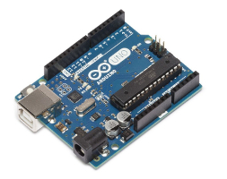
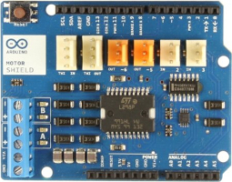
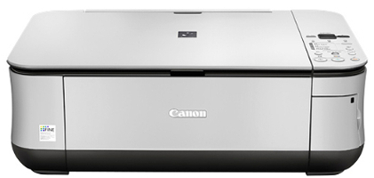
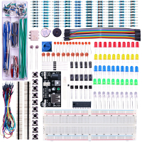
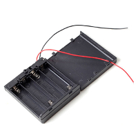
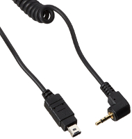
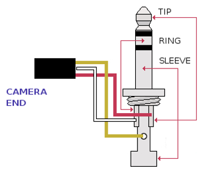
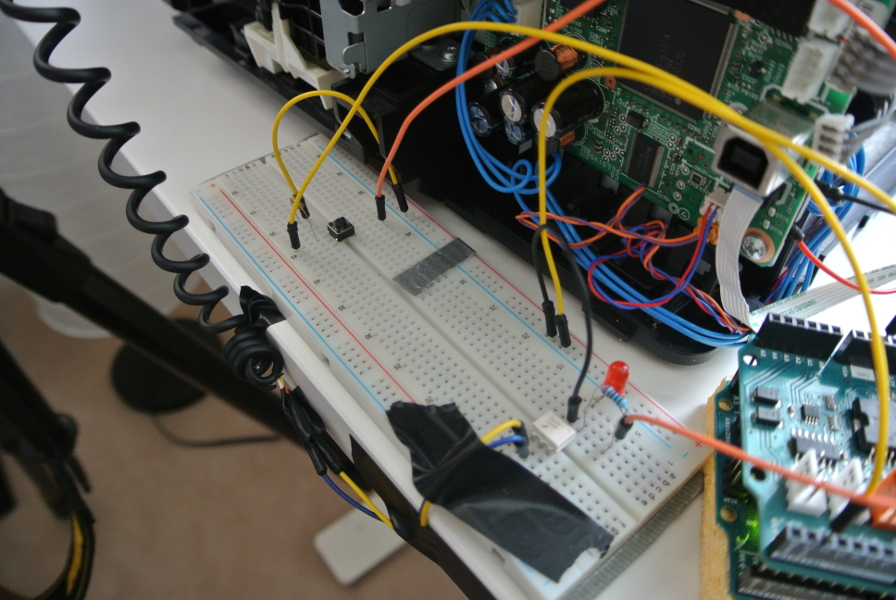
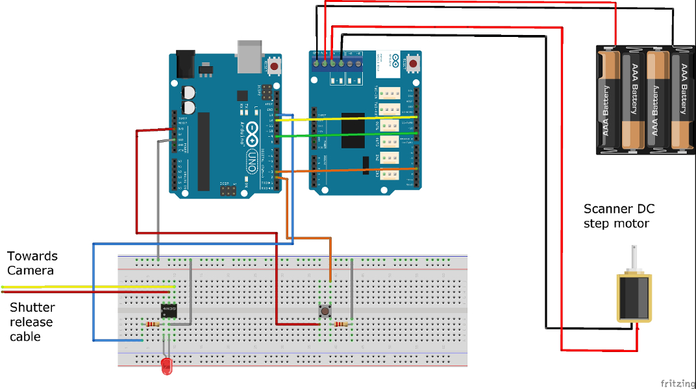
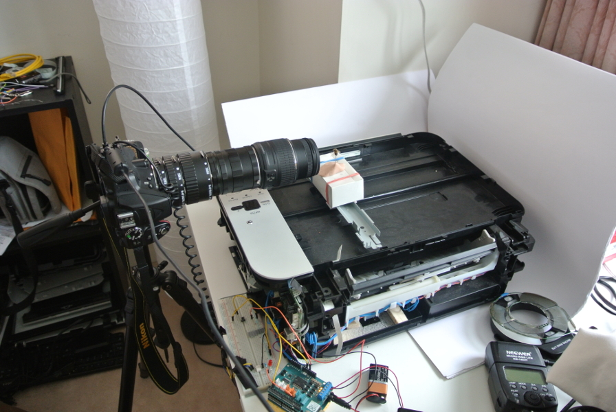

 

### **Disclaimer:**
 <ol>
	<li>
	
The authors cannot be held responsible, in any case, for accidents,
    personal injuries or damages to your camera and electronic equipment
    which either derive from or are caused by use or misuse of the
    information and instructions provided in these tutorials.
	
</li>
	<li>
	
The bee used to take the photos presented in these tutorials was
    already dead when we found it. We have a hive in our garden and love
    bees. Do NOT kill bees.
	
</li>
 </ol>

 

About Focus Stacking
====================

Focus stacking is a simple technique enabling to take high quality
pictures in macrophotography by solving issues caused by the limitation
in depth of field. In more simple terms, let’s say that, for example,
you want to take a macrophotograph of a dead bee you just found (you
creepy). You are going to focus the image on one specific part of the
subject (the head, the wing, or whatever) but the rest of the image will
be blurry. Focus stacking eliminates blurry parts by taking multiple
pictures of the subject, moving the camera forward by increments of a
few mm (or micrometers) each time, and merging them. Each image is
focused on a different region of the subject. Using an image processing
software, all the pictures are stacked (merged) to create a new one that
contain all the focused regions. By doing so, you end up with a high
quality image that is focused on every part of the subject (without
blurry parts).

 

The Arduino Controller
======================

This is easy to say, but trying to do that manually is pretty much
impossible. That’s when the controller enters into the game. A simple
and low-cost controller that will do the job for you can be easily built
with an Arduino UNO, a breadboard, an old scanner and a few other
electronic components.

 

What you will need
------------------

Note that all prices are in Canadian dollars as of February 18th, 2017.

 

<table style="width:67%;">
<colgroup>
<col width="25%" />
<col width="22%" />
<col width="19%" />
</colgroup>
<thead>
<tr class="header">
<th>Components</th>
<th>Picture</th>
<th>Cost</th>
</tr>
</thead>
<tbody>
<tr class="odd">
<td>   Arduino UNO R3</td>
<td></td>
<td>   $24.99</td>
</tr>
<tr class="even">
<td>   Arduino motor shield R3</td>
<td></td>
<td>   $50.29</td>
</tr>
<tr class="odd">
<td> Old broken scanner  (Canon MP250 in our case)</td>
<td></td>
<td>  $0</td>
</tr>
<tr class="even">
<td>  Electronic Kit with   breadboard, jumper wires,  resistors, button,  a 4N35 optocoupler &amp; leds</td>
<td></td>
<td>    $22.99</td>
</tr>
<tr class="odd">
<td>    Switched 4 x AA   battery pack</td>
<td></td>
<td>    $2.29</td>
</tr>
<tr class="even">
<td>    Shutter release cable</td>
<td></td>
<td>    $8.00</td>
</tr>
<tr class="odd">
<td><strong>TOTAL</strong></td>
<td></td>
<td><strong>$108.56</strong></td>
</tr>
</tbody>
</table>

 

Do it yourself
==============

1. Controlling the scanner motor with the Arduino
-------------------------------------------------

Remove the top window and the lamp of your scanner. In our case, the DC
step motor driving the lamp back and forth was located just under the
lamp. We kept the small platform supporting the lamp and attached to the
motor which will be used later to place the subject to photograph. You
will also need to unmount whatever is necessary to find the circuit
board of your scanner. On the circuit board, find which chip is
controlling the motor (we did that simply by following the DC step motor
wires to the circuit board). Use the wires of your battery pack to find
which pins on the chip are supplying power to the motor. Once you found
them, weld two wires to the power and ground legs of the chip (we welded
them at the back of the circuit board, it was easier and required less
precision). Line up the legs of your Arduino motor shield with the pins
of the Arduino UNO and push the two boards together. Connect the two
wires you just welded to the “+” and “-” Channel A terminals of your
motor shield. Connect the wires of the battery pack to the VIN and GND
terminals of the motor shield, and make sure it is turned off for now.
We used pins 3, 9 and 12 of the Arduino to control the motor speed,
brake and direction, respectively.

 

 

2. Controlling your camera shutter release
------------------------------------------

The next step is to ensure communication with your camera. We used pin
13 to trigger the camera shutter release and pin 2 to respond to button
actuation. The idea here is to use a button to actuate the photo stack
sequence. When the button is pressed, the DC step motor will move
forward by increments of a defined distance and at each increment, the
motor will stop and the camera shutter will be triggered to take a
photo. At the end of the sequence, the motor will return to its initial
position.

 

### 2.1. Connection to the optocoupler

Wire pin 13 of your Arduino to a 1 MO resistor (on your breadboard),
itself connected to leg 1 (anode) of a 4N35 optocoupler (leg 1 is the
closest to the small engraved circle at the top of the 4N35). Leg 2
(cathode) of the 4N35 is wired to the ground. You can place a led
between legs 1 and 2 of the 4N35 that will light up each time the camera
shutter is triggered. Cut the stereo jack from the shutter release cable
and strip the three wires. The color of the wires should be (in most
cases!) red, white and yellow and correspond respectively to the tip,
ring and sleeve of the stereo jack. The tip (red wire) and the ring
(white wire) control respectively the camera shutter release and focus.
The sleeve (yellow wire) is the ground. Connect the red (camera shutter
release) and white (focus) wires (we welded them together) to leg 5
(collector) of the 4N35. Connect the yellow wire (ground) to leg 6
(emitter) of the 4N35.

 

### 2.2. Connection to the button

Connect one leg of the button (6 mm pushbutton switch in our case) to
the 3.3V pin of the Arduino. On the other side of the pushbutton (side
not connected to the 3.3V), wire a 1 MO resistor to one leg and connect
the other leg to pin 2 of your Arduino UNO. The 1 MO resistor is
connected to the ground, this makes it a pull-down resistor. A schema of
the circuit is presented below as well as the code. Upload the code to
your Arduino UNO and you are done. Enjoy!

 

 

General schema
==============

 

 

The Code (C\#)
==============

 

    int motordirection = 12;
    int motorbrake = 9;
    int motorspeed = 3;
    int camera = 13;
    int button = 2;

    void setup() {
     
      //Setup Channel A
      pinMode(motordirection, OUTPUT);  //Initiates Motor Channel A pin
      pinMode(motorbrake, OUTPUT);      //Initiates Brake Channel A pin
      pinMode(camera, OUTPUT);
      pinMode(button, INPUT);
      Serial.begin(9600);
    }

    void loop(){

      boolean buttonState = digitalRead(button);
      Serial.print("Button State ");
      Serial.println(buttonState);
      delay(100);

      if(buttonState==HIGH){

      int myCount = 0;
      
      while(myCount < 5){                      //how many photos

      Serial.print("Photo Stack ");
      Serial.println(myCount);
      
      //forward @ full speed
      digitalWrite(motordirection, HIGH);   //Establishes forward direction of Channel A
      digitalWrite(motorbrake, LOW);        //Disengage the Brake for Channel A
      analogWrite(motorspeed, 255);         //Spins the motor on Channel A at full speed
      
      delay(100);                            //distance
      
      digitalWrite(motorbrake, HIGH);       //Engage the Brake for Channel A
      delay(100);
      digitalWrite(camera, HIGH);
      delay(200);
      digitalWrite(camera, LOW);
      delay(200);                           //stop after move 

      myCount = myCount + 1;
      }

      //backward @ half speed
      digitalWrite(motordirection, LOW);    //Establishes backward direction of Channel A
      digitalWrite(motorbrake, LOW);        //Disengage the Brake for Channel A
      analogWrite(motorspeed, 255);         //Spins the motor on Channel A at half speed
      
      delay(100*myCount);                            //distance backwards
      
      digitalWrite(motorbrake, HIGH);  
      delay(100);
      
      myCount = 0;
     
      }
    }

 

General view of the setup
=========================

 

 

